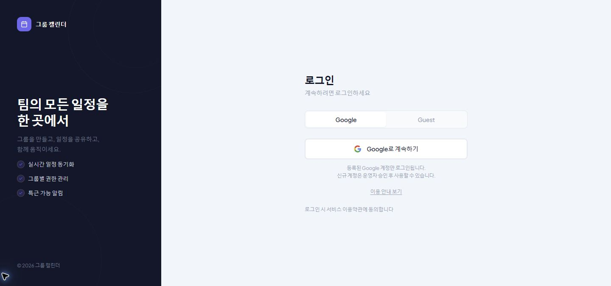
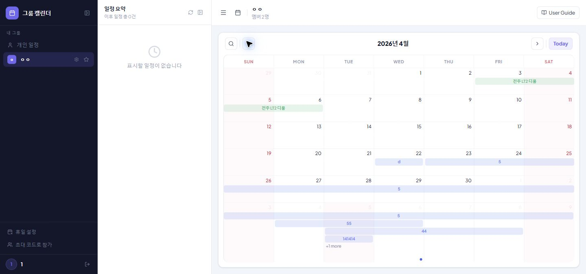
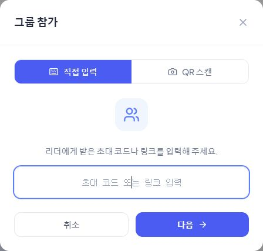
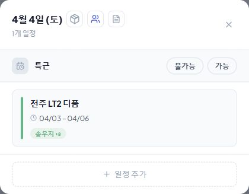
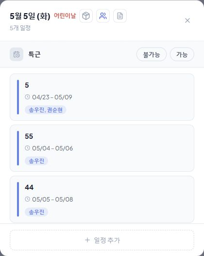

# 그룹 캘린더 사용설명서

이 문서는 2026년 6월 2일 기준으로 프로젝트를 직접 브라우저에서 열어 확인한 화면을 바탕으로 작성했습니다.

팝업 화면은 요청에 맞춰 전체 화면이 아니라 팝업 영역만 따로 잘라낸 이미지로 정리했습니다.

## 1. 로그인

앱에 처음 들어오면 로그인 화면이 보입니다.

- `Google` 탭: 등록된 Google 계정으로 로그인할 때 사용합니다.
- `Guest` 탭: 이름과 사번으로 로그인하거나 가입 요청을 보낼 때 사용합니다.
- 화면 하단의 `이용 안내 보기`: 로그인 방식과 승인 흐름을 확인할 수 있습니다.

## 2. 메인 화면

로그인 후에는 그룹별 캘린더 화면으로 들어옵니다.

- 왼쪽 사이드바: 내 그룹 목록, 휴일 설정, 초대 코드로 참가, 로그아웃
- 가운데 상단: 현재 선택된 그룹 이름과 멤버 수
- 캘린더 상단 버튼
- `Summary`: 요약 보기 전환
- `이전 달`, `다음 달`: 월 이동
- `Today`: 오늘이 포함된 달로 이동
- 달력 셀 또는 일정 막대를 클릭하면 해당 날짜의 일정 팝업이 열립니다.

## 3. 자주 쓰는 기능

### 3-1. 그룹 참가 팝업

사이드바의 `초대 코드로 참가`를 누르면 그룹 참가 팝업이 열립니다.

- `직접 입력`: 초대 코드 또는 초대 링크를 직접 입력
- `QR 스캔`: QR 코드를 카메라로 읽어서 참가
- 코드 확인 후 다음 단계에서 닉네임을 정하고 참가 요청을 보냅니다.

### 3-2. 일정 상세 팝업

달력 안의 일정 하나를 클릭하면 해당 날짜의 일정 상세 팝업이 열립니다.

- 상단: 날짜, 휴일 여부, 관련 상태 아이콘
- `특근 가능 / 불가능`: 해당 날짜의 특근 상태를 표시하거나 변경
- 일정 카드: 제목, 기간, 작성자 확인
- 하단 `+ 일정 추가`: 같은 날짜에 새 일정을 추가

### 3-3. 하루 일정 목록 팝업

하루에 일정이 많아서 `+1 more` 같은 링크가 보이면 클릭해서 그 날짜의 전체 일정을 볼 수 있습니다.

- 같은 날짜에 등록된 여러 일정을 한 번에 확인
- 각 일정 카드를 클릭하면 다시 상세 화면으로 이동
- 하단 `+ 일정 추가`: 그 날짜 기준으로 새 일정 등록

## 4. 기본 사용 흐름

1. 로그인합니다.
2. 왼쪽에서 그룹을 선택합니다.
3. 월을 이동하면서 일정을 확인합니다.
4. 날짜 또는 일정을 눌러 상세 팝업을 엽니다.
5. 필요하면 초대 코드로 다른 그룹에 참가합니다.

## 5. 참고

- 이번 문서에 사용한 팝업 이미지는 모두 팝업 영역만 따로 잘라낸 이미지입니다.
- 계정 권한에 따라 일부 버튼이나 관리 기능은 보이지 않거나 동작이 다를 수 있습니다.
